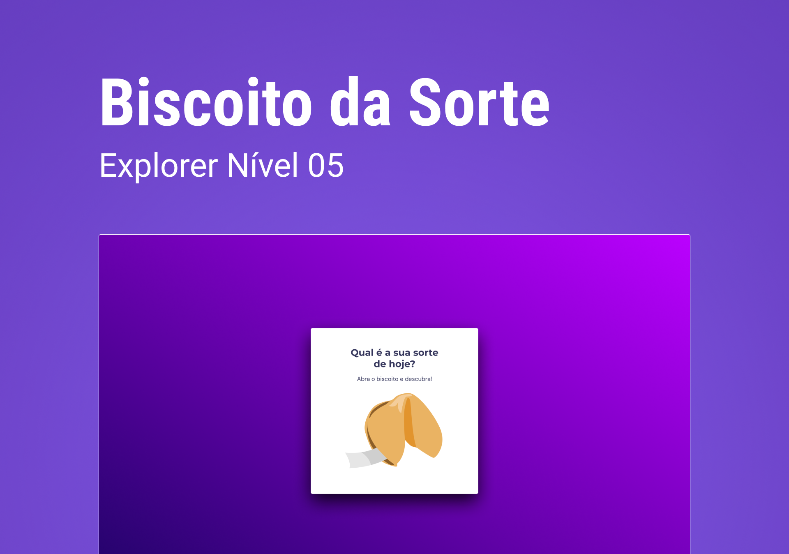

<h1 align="center"> Jogo de Adivinhação</h1>

  <a href="#-tecnologias">Tecnologias</a>&nbsp;&nbsp;&nbsp;|&nbsp;&nbsp;&nbsp;
  <a href="#-projeto">Projeto</a>&nbsp;&nbsp;&nbsp;|&nbsp;&nbsp;&nbsp;
  <a href="#-layout">Layout</a>

 

  

## 🚀 Tecnologias

Esse projeto foi desenvolvido com as seguintes tecnologias:

- HTML e CSS
- Javascript
- Git e Github

## 💻 Projeto

Este projeto foi desenvolvido como primeiro desafio do Stage 05: Avançando com JavaScript, do curso Explorer da Rocketseat.

Conceitos explorados:

- Animações com CSS
- Funções no JavaScript
- Manipulação da DOM
- Biblioteca JS Math()
- Arrays
- Event listeners

Você pode visualizar o projeto através [DESSE LINK](https://viviansanchez.github.io/rocketseat-explorer-stage05-desafio01/)!

## 🔖 Layout

Você pode visualizar o layout do projeto através [DESSE LINK](https://www.figma.com/community/file/1182751789348533739/Biscoito-da-Sorte). É necessário ter conta no [Figma](https://figma.com) para acessá-lo.
